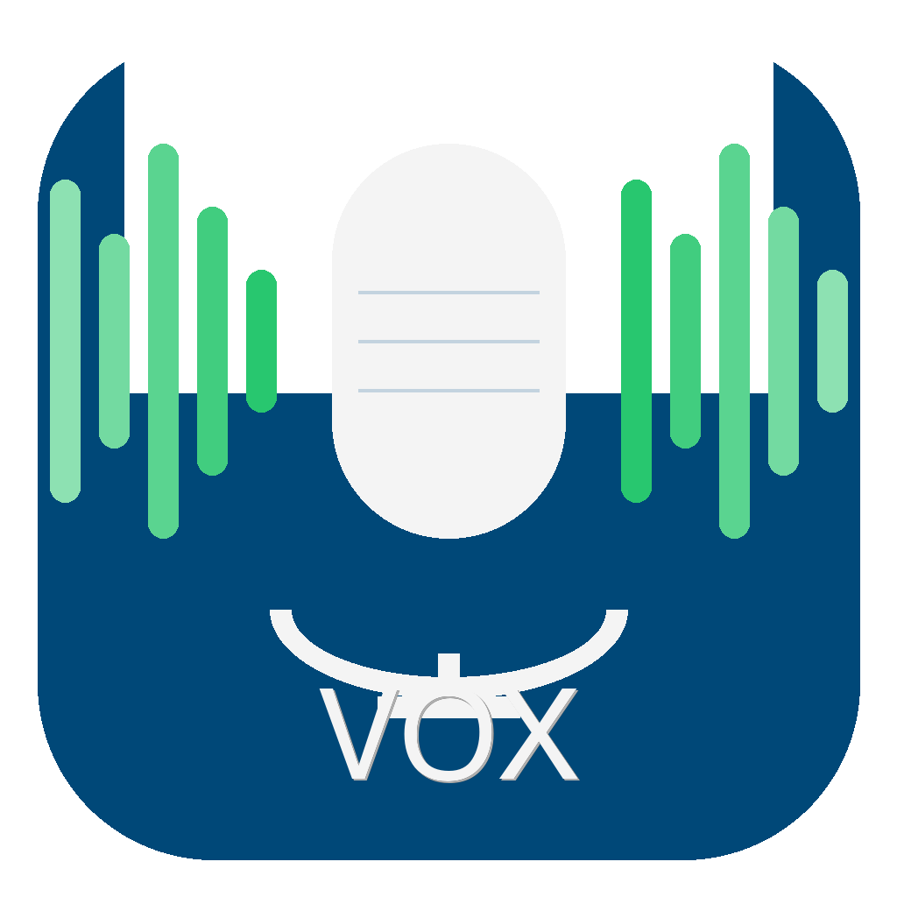

# VOX — Voice-Operated eXecution

> Talk to your terminal. Hear what matters.

VOX is an open-source macOS menu bar companion for [Hex](https://hex.kitlangton.com/). When you dictate a command via Hex — whether in Terminal, Cursor, VS Code, or Windsurf — VOX monitors the output and reads it back to you with configurable verbosity. Adaptive voices detect the language of the response and pick a matching voice automatically. Built with Swift 6 and SwiftUI, VOX runs entirely on-device with zero telemetry.

<p align="center">
  
</p>

## Why VOX?

Developers using voice-driven tools like [Hex](https://hex.kitlangton.com/) can dictate commands — but they still have to read the output. With AI assistants producing lengthy responses (Claude Code, Cursor, Windsurf), the bottleneck has shifted from typing to reading.

VOX closes the loop: **dictate your command with Hex, hear the response from VOX**. No more reading 500-word outputs when a 2-sentence summary tells you everything you need.

### Supported Apps

| App | Reading Method | Status |
|-----|---------------|--------|
| **Terminal.app** | AppleScript | Stable |
| **iTerm2** | AppleScript | Stable |
| **Cursor** | Accessibility API | Stable |
| **VS Code** | Accessibility API | Stable |
| **Windsurf** | Accessibility API | Stable |

## How It Works

VOX has two reading paths depending on the target app:

```
Terminal / iTerm2:  Hex dictates → Command runs → VOX reads output via AppleScript
Cursor / VS Code / Windsurf:  Hex dictates → AI responds → VOX reads chat via Accessibility API
```

1. **Hex** listens to your voice and types the transcription into the active app
2. **The app** processes the command or AI prompt
3. **VOX** detects new output (AppleScript for terminals, Accessibility API for editors), processes it according to your verbosity level, and speaks the result

For Chromium-based editors (Cursor, VS Code, Windsurf), VOX uses intelligent chat fragment assembly — collecting multiple AX text elements and reassembling them into a coherent response before reading it aloud.

## Features

### Core
- **Terminal monitoring** — Detects new output in Terminal.app and iTerm2 via AppleScript
- **Editor monitoring** — Reads AI chat responses in Cursor, VS Code, and Windsurf via Accessibility API
- **Smart long-running task detection** — Two-phase stabilization with adaptive polling handles 30-40+ minute Claude Code sessions without premature summarization
- **Terminal prompt detection** — Instantly detects when a command finishes by recognizing shell prompts (bash, zsh, starship)
- **Chat fragment assembly** — Reassembles fragmented Chromium AX text elements into coherent responses
- **Hex integration** — Watches Hex's `transcription_history.json` for new dictations with source app context
- **Per-app verbosity** — Configure different verbosity levels per target app

### TTS & Voice
- **3 TTS engines** — macOS native, Edge TTS (free Microsoft Neural voices), ElevenLabs (premium multilingual)
- **Adaptive voices** — Auto-detects text language (Dutch/English/German) and selects a matching voice
- **Gender preference** — Choose male or female; VOX picks the right voice for each language automatically
- **Localized summaries** — Heuristic summaries spoken in your configured language (NL/EN/DE)

### Intelligence
- **Smart summaries** — 4 verbosity levels: Silent, Notice, Summary, Full
- **Ollama integration** — Local AI summarization using configurable Ollama models
- **Error escalation** — Automatically increases verbosity when errors occur
- **Terminal UI stripping** — Removes progress bars, ANSI codes, model info, and UI artifacts before speaking

### Fun
- **Sound Pack Store** — Search and install game sounds from MyInstants (Warcraft, Mario, Zelda, C&C)
- **Custom sound packs** — Create your own sound packs with success/error audio files
- **System sounds** — Use macOS built-in sounds for notices

### General
- **Command history** — Searchable, filterable log of all monitored commands and responses
- **Onboarding wizard** — 3-step setup: Hex, TTS, Voice Test
- **Code signed** — Persistent Accessibility permissions across updates
- **Privacy-first** — All processing on-device, no telemetry, no cloud required

## Requirements

- macOS 14.0 (Sonoma) or later
- [Hex](https://hex.kitlangton.com/) for speech-to-text
- Xcode 16+ / Swift 6 (for building from source)
- **Accessibility permission** required for Cursor, VS Code, and Windsurf (the app will prompt you)

Terminal and iTerm2 reading works without any special permissions.

### Optional Dependencies

| Dependency | Required For | Install |
|-----------|-------------|---------|
| [edge-tts](https://github.com/rany2/edge-tts) | Free Microsoft Neural voices | `pip3 install edge-tts` |
| [Ollama](https://ollama.com) | Local AI summarization | Download from ollama.com |
| ElevenLabs API key | Premium multilingual voices | Sign up at elevenlabs.io |

## Quick Start

### Install as macOS App

```bash
# Clone the repository
git clone https://github.com/RichardTheuws/VOX-app.git
cd VOX-app

# Build and install to /Applications
./scripts/build-app.sh --install

# Or build, install, and launch immediately
./scripts/build-app.sh --install --open
```

After installation, VOX appears in Spotlight search and can be launched like any macOS app. It lives in your menu bar as an ear icon.

### Code Signing (for Accessibility permissions)

If you want VOX to remember Accessibility permissions across rebuilds:

```bash
# Create a self-signed certificate (one-time)
# Open Keychain Access → Certificate Assistant → Create Certificate
# Name: "VOX Developer", Type: Code Signing

# Build with code signing
./scripts/build-app.sh --install --sign "VOX Developer"
```

### Build from Source

```bash
# Debug build
swift build

# Run directly
.build/debug/VOX

# Release build (optimized)
swift build -c release

# Build .app bundle only (no install)
./scripts/build-app.sh
# Output: build/VOX.app
```

### Run Tests

```bash
swift test
# 118 tests, 0 failures
```

## Verbosity Levels

Configure per-app in Settings or set a global default:

| Level | Name | What you hear |
|-------|------|---------------|
| 0 | **Silent** | Nothing (visual indicator only) |
| 1 | **Notice** | Short confirmation or sound effect |
| 2 | **Summary** *(default)* | Heuristic 1-2 sentence summary |
| 3 | **Full** | Complete response read aloud |

### Notice Mode Options

Notice mode supports multiple feedback styles:

- **TTS** — Spoken confirmation ("Done" / "Klaar" / "Fertig")
- **Warcraft** — "Job's done!", "Work complete", "Zug zug"
- **Mario** — Coin sounds, power-ups, game over
- **Zelda** — Item found, secret discovered, fairy fountain
- **Command & Conquer** — "Acknowledged", "Affirmative", "Building"
- **System Sounds** — macOS Glass, Ping, Basso, etc.
- **Custom Sound Packs** — Your own audio files

### Summary Intelligence

The Summary level uses smart heuristics to extract what matters:
- **Git status**: file counts, branch name, clean/dirty state
- **Git log**: commit count
- **Build output**: success/failure with error details
- **General output**: first meaningful line + total line count
- **Error detection**: finds the most informative error line
- **Error escalation**: automatically increases verbosity on errors

All summaries are localized to your configured response language (English, Dutch, or German).

## TTS Engines

VOX supports three text-to-speech backends:

| Engine | Quality | Cost | Languages | Setup |
|--------|---------|------|-----------|-------|
| **macOS Native** | Basic | Free | System voices | Built-in |
| **Edge TTS** | High (Neural) | Free | NL, EN, DE + more | `pip3 install edge-tts` |
| **ElevenLabs** | Premium | Paid | 29+ languages | API key in Settings |

### Adaptive Voice Selection

Instead of manually choosing a voice, you set a **gender preference** (male/female). VOX then:

1. Detects the language of the text being spoken (using Apple's NLLanguageRecognizer)
2. Selects the appropriate voice for that language + your gender preference

**Edge TTS voice mapping:**

| Language | Female | Male |
|----------|--------|------|
| Dutch | Colette Neural | Maarten Neural |
| English | Jenny Neural | Guy Neural |
| German | Amala Neural | Conrad Neural |

**macOS Native** matches system voices by locale + gender. **ElevenLabs** uses the `eleven_multilingual_v2` model which auto-detects language.

## Architecture

```
VOX (Menu Bar App)
├── Models/
│   ├── VerbosityLevel.swift       — 4-level verbosity enum with cycling
│   ├── TargetApp.swift            — Terminal, iTerm2, Cursor, VS Code, Windsurf
│   ├── VoxCommand.swift           — Command history model with Codable
│   ├── VoxSettings.swift          — @AppStorage settings + VoiceGender + ResponseLanguage
│   ├── VOXVersion.swift           — Centralized version constant
│   └── NoticeSoundPack.swift      — Sound packs with game-themed phrases
├── Services/
│   ├── HexBridge.swift            — Monitors Hex transcription_history.json
│   ├── TerminalReader.swift       — Reads terminal content via AppleScript
│   ├── AccessibilityReader.swift  — Reads editor AI chat via Accessibility API
│   ├── ResponseProcessor.swift    — Verbosity-aware output summarization (NL/EN/DE)
│   ├── TTSEngine.swift            — TTS with 3 backends + adaptive voice selection
│   ├── LanguageDetector.swift     — NLLanguageRecognizer wrapper for text language detection
│   ├── OllamaService.swift        — Local Ollama API for AI summarization
│   ├── SoundPackStore.swift       — MyInstants API for downloadable sound packs
│   └── CommandHistory.swift       — Persistent command log (JSON)
├── Views/
│   ├── MenuBarView.swift          — Menu bar dropdown with status + actions
│   ├── SettingsView.swift         — 4-tab settings window
│   ├── HistoryView.swift          — Searchable command history
│   ├── OnboardingView.swift       — 3-step first-run wizard
│   └── SoundPackInstallerView.swift — Sound pack browser + installer
├── AppState.swift                 — Central coordinator (Hex → Monitor → TTS)
└── VOXApp.swift                   — @main entry point with MenuBarExtra
```

### Key Design Decisions

- **Menu bar-only app** — Uses `NSApp.setActivationPolicy(.accessory)` to live in the menu bar without a dock icon
- **Pure companion** — VOX never executes commands. It only reads output and speaks it
- **Dual reading paths** — AppleScript for terminals (reliable, no permissions needed), Accessibility API for editors (requires permission grant)
- **Chat fragment assembly** — Chromium apps expose AI chat as many small AX elements. VOX collects and reassembles them into coherent text
- **Adaptive voices** — Language detection on the text being spoken, not on user settings. This means a Dutch summary of English terminal output uses a Dutch voice
- **Reactive state with Combine** — `AppState` uses `@Published` properties for reactive UI updates

## Settings

VOX offers a 4-tab settings window:

- **General** — Launch at login, theme, response language (English/Dutch/German), input language
- **Apps** — Per-app verbosity levels, auto-detect target app
- **TTS** — Engine selection, voice gender, speed, volume, notice sound packs, interrupt behavior
- **Advanced** — Summarization method (heuristic/Ollama), Ollama model, monitor timeout, logging

## Hex Integration

VOX uses [Hex](https://hex.kitlangton.com/) for on-device speech-to-text:

1. **Install Hex** from [hex.kitlangton.com](https://hex.kitlangton.com/)
2. **Start Hex** — it runs in your menu bar alongside VOX
3. **Speak** — Hex transcribes your voice and types it into the active app
4. **VOX detects** the transcription via Hex's history file and monitors the output

No audio data ever leaves your Mac. Hex supports multiple model sizes with different accuracy/speed tradeoffs.

## Roadmap

| Version | Milestone | Status |
|---------|-----------|--------|
| v0.1 | Terminal + Claude Code CLI + macOS Say TTS | Done |
| v0.2 | Floating panels + menu bar improvements | Done |
| v0.3 | App icon + .app bundle + onboarding wizard | Done |
| v0.4 | Hex file monitoring + auto-process transcriptions | Done |
| v0.5 | Monitor mode — read terminal output via AppleScript | Done |
| v0.6 | Strip to pure Hex companion — remove execution | Done |
| v0.7 | Ollama summaries + notice sound packs + terminal UI stripping | Done |
| v0.8 | Sound Pack Store — search & install game sounds | Done |
| v0.9 | Edge TTS + ElevenLabs + Accessibility API for editors | Done |
| v0.10 | Code signing + chat fragment assembly + full response reading | Done |
| v1.0 | Adaptive voices + localized summaries + 106 tests | Done |
| **v1.1** | **Smart long-running task detection + adaptive polling + 118 tests** | **Current** |

## Tech Stack

| Component | Technology |
|-----------|------------|
| Language | Swift 6 / SwiftUI |
| STT | [Hex](https://hex.kitlangton.com/) (WhisperKit/Parakeet, on-device) |
| TTS | Edge TTS / ElevenLabs / macOS NSSpeechSynthesizer |
| Terminal Reading | AppleScript via `/usr/bin/osascript` |
| Editor Reading | Accessibility API (AXUIElement) |
| Language Detection | Apple NLLanguageRecognizer (NaturalLanguage framework) |
| AI Summarization | Ollama (local, optional) |
| Platform | macOS 14+ (Apple Silicon optimized) |
| Testing | XCTest — 118 unit tests |
| Build | Swift Package Manager |

## Privacy & Security

- **No cloud required** — All processing happens on your Mac
- **No telemetry** — Zero analytics, zero tracking, zero data collection
- **No audio storage** — Voice audio is never saved; only transcriptions are logged (optionally)
- **No shell access** — VOX reads output, never executes commands
- **Accessibility permission** — Required only for Cursor/VS Code/Windsurf. VOX reads the visible AI chat panel text. It does not access files, keystrokes, or other app data
- **Open source** — Full source code is public and auditable

## Contributing

Contributions are welcome! Please open an issue or pull request.

### Development Setup

```bash
git clone https://github.com/RichardTheuws/VOX-app.git
cd VOX-app
swift build
swift test  # 118 tests should pass
```

## License

MIT License — see [LICENSE](LICENSE)

## Brand

Part of the [tools.theuws.com](https://tools.theuws.com) ecosystem.

---
Version 1.1.0
